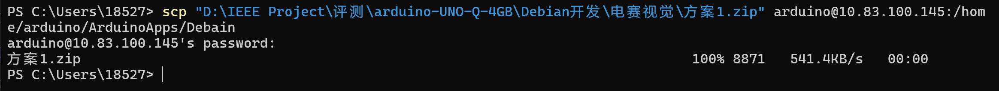
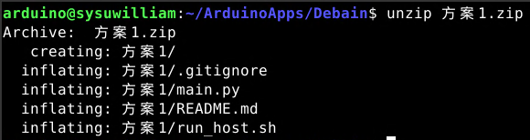

1. 将项目压缩为.zip文件
2. scp传输
   scp "路径" arduino@板子IP:/home/arduino/路径

3. 解压文件
   unzip xxx.zip

示例：
1. scp "D:\IEEE Project\评测\arduino-UNO-Q-4GB\Debian开发\电赛视觉\方案1.zip" arduino@10.83.100.145:/home/arduino/ArduinoApps/Debain

2. unzip 方案1.zip

3. 执行脚本
bash run_host.sh