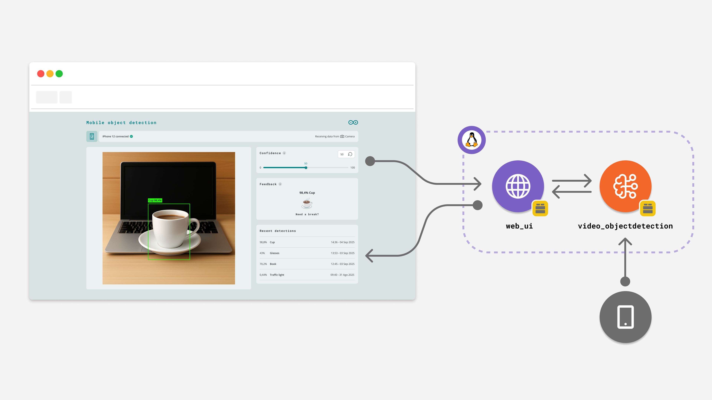
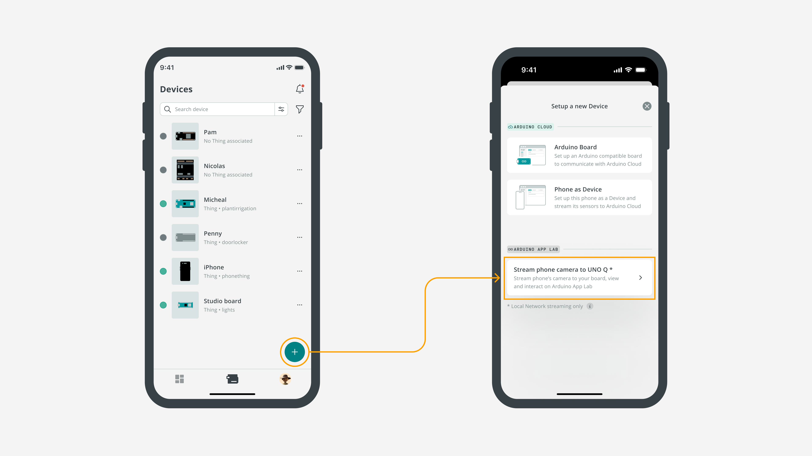

# Detect Objects on Smartphone Camera

**Detect Objects on Smartphone Camera** 示例允许你使用手机摄像头的实时画面进行目标检测，并在网页界面中实时显示检测框和识别结果。

**注意：** 该示例使用手机作为远程摄像头输入，因此 **Arduino UNO Q** 和你的手机必须连接到同一个本地网络。



本示例使用一个预训练模型，对来自 **Arduino IoT Remote** 手机应用的视频流进行目标检测。整体流程包括：通过二维码将手机与开发板配对、通过局域网传输视频、使用 `video_objectdetection` Brick 进行 AI 推理，并在网页界面中显示检测框与识别结果。整个 App 通过一个交互式 Web 界面管理。

## 使用到的 Bricks

本示例使用了以下 Bricks：

- `web_ui`：用于创建 Web 界面，显示检测结果、模型控制项和配对二维码。
- `video_objectdetection`：用于对实时视频流中的对象进行检测。

## 硬件和软件要求

### 硬件

- [Arduino® UNO Q](https://store.arduino.cc/products/uno-q)
- 智能手机（iOS 或 Android）
- 可访问网页界面的个人电脑

### 软件

- **Arduino App Lab**（运行在开发板上）
- **Arduino IoT Remote App**（安装在手机上）

## 示例使用方法

### Arduino App Lab 设置

1. 确保 Arduino UNO Q 已上电并连接到网络。
2. 在 Arduino App Lab 中运行该 App。
3. App 应该会自动在浏览器中打开；你也可以手动访问 `<board-name>.local:7000`。
4. Web 界面上会显示一个 **二维码**。

### Arduino IoT Remote 设置

5. 在手机应用商店中安装 **Arduino IoT Remote**。
6. 打开 Arduino IoT Remote，并使用你的 Arduino 账号登录。
7. 进入 `Devices`，点击加号添加新设备，选择 **Stream phone camera to UNO Q**。
   
8. 扫描网页上的二维码。
9. 连接成功后，手机的视频流就会显示在网页界面中。
10. 将手机镜头对准物体，观察 App 如何检测并识别它们。

你可以尝试以下物体，以触发更明显的反馈效果：

- 猫
- 手机
- 时钟
- 杯子
- 狗
- 盆栽植物

## 工作原理

该示例托管了一个 Web UI，用于协调手机摄像头与开发板之间的连接。视频流通过网络传输到开发板，经过 `video_objectdetection` Brick 处理后，再把识别结果发送回浏览器。检测到目标后，界面会显示目标类别和置信度，例如：`95% potted plant`。

下面从前后端两个部分简要说明这个全栈示例。

### 后端（`python/main.py`）

- **安全和连接**
  - 生成一个随机的 6 位数字密钥 `generate_secret()`，用于保护手机与开发板之间的配对连接。
  - 初始化 `WebSocketCamera(secret=secret, encrypt=True)`，把手机视频流作为远程摄像头输入。

- **App 初始化**
  - `WebUI()`：负责管理前端页面和浏览器通信。
  - `VideoObjectDetection(camera, ...)`：以远程摄像头为输入，对视频画面执行目标检测。

- **事件处理**
  - 监听摄像头状态变化，并把 `connected`、`streaming` 等状态同步到前端页面。
  - 当浏览器连接时，通过 `ui.on_connect(...)` 向前端发送 `secret`、`ip`、`port` 等配对信息，以生成二维码。
  - 通过 `on_detect_all(...)` 把检测结果推送到前端，包括目标类别、置信度和时间戳。

- **控制项**
  - 监听前端发送的 `override_th` 消息，动态修改目标检测的置信度阈值。

### 前端（`assets/index.html + assets/app.js`）

- **配对流程**
  - 通过 Socket.IO 接收后端发来的 `secret`、`ip` 和 `port`。
  - 使用 `qrcode.min.js` 生成二维码，二维码中包含手机连接到开发板所需的配对信息。

- **视频显示**
  - 当手机成功连接后，页面会从二维码视图切换到视频 iframe 视图，显示实时视频流。

- **反馈与控制**
  - **置信度滑块**：用于调整 AI 模型的检测阈值。
  - **视觉反馈**：当检测到某些目标对象（如 `cup`、`cat`）且置信度较高时，界面会显示对应动画和提示文字。
  - **最近检测列表**：显示最近 5 条检测记录及其时间戳。

## 代码理解

当应用运行后并在浏览器中打开时，系统主要执行以下几类工作：

### 1. 提供 Web UI，并处理远程摄像头配对

后端首先生成一个安全密钥，并初始化 `WebSocketCamera`。当浏览器连接后，后端会把这些配对信息发给前端。

```python
def generate_secret() -> str:
  characters = string.digits
  return ''.join(secrets.choice(characters) for _ in range(6))

secret = generate_secret()
ui = WebUI()
camera = WebSocketCamera(secret=secret, encrypt=True)

ui.on_connect(lambda sid: ui.send_message("welcome", {
    "client_name": camera.name,
    "secret": secret,
    "status": camera.status,
    "protocol": camera.protocol,
    "ip": camera.ip,
    "port": camera.port
}))
```

### 2. 处理视频帧并广播检测结果

`VideoObjectDetection` Brick 使用远程摄像头的视频帧做推理。检测到目标后，回调函数会把整理好的结果发给浏览器。

```python
detection = VideoObjectDetection(camera, confidence=0.5, debounce_sec=0.0)

def send_detections_to_ui(detections: dict):
  for key, values in detections.items():
    for value in values:
      entry = {
        "content": key,
        "confidence": value.get("confidence"),
        "timestamp": datetime.now(UTC).isoformat()
      }
      ui.send_message("detection", entry)

detection.on_detect_all(send_detections_to_ui)
```

### 3. 在前端生成二维码

前端 `app.js` 会等待 `welcome` 消息，然后生成二维码，用来把手机和开发板配对起来。

```javascript
socket.on('welcome', async (message) => {
    webcamState.secret = message.secret;
    webcamState.protocol = message.protocol;
    webcamState.ip = message.ip;
    webcamState.port = message.port;
    updateDisplay();
});

function updateDisplay() {
    if (webcamState.status != "connected") {
        if (webcamState.secret) {
            generateQRCode(webcamState.secret, webcamState.protocol, webcamState.ip, webcamState.port);
        }
    }
}
```

### 4. 运行 App 主循环

最后，后端通过：

```python
App.run()
```

维持整个应用运行，协调手机、AI 模型和浏览器之间的网络通信。

## 备注

这个示例默认使用的是 HTTP，仅用于示例演示。  
如果你想改成 HTTPS，可以：

1. 先复制一份这个示例
2. 创建证书文件 `cert.pem` 和 `key.pem`
3. 将它们保存到 `/app/certs`
4. 按如下方式初始化 `WebUI`

```python
ui = WebUI(use_tls=True, certs_dir_path='/app/certs')
```
