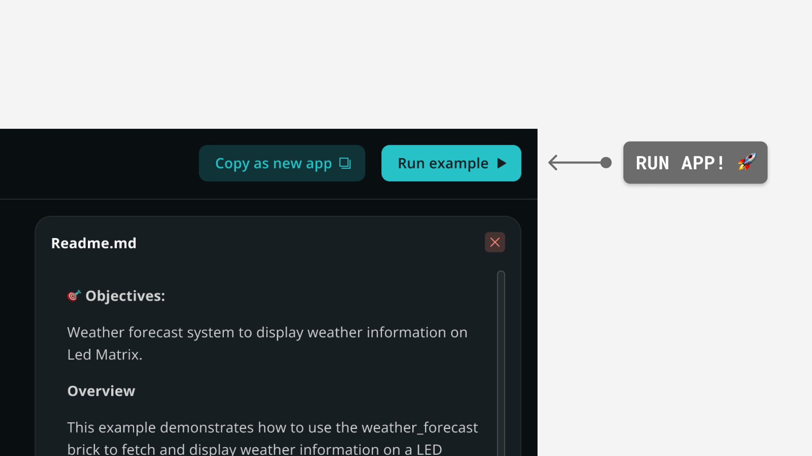

# Weather forecast on LED matrix

The **Weather Forecasting System** displays real-time weather information from the *open-meteo.com* service on the Arduino UNO Q LED matrix. It shows weather conditions like *sunny*, *cloudy*, *rainy*, *snowy* or *foggy* using animated visual patterns that update automatically every 10 seconds.


## Description

The App fetches weather data from the *open-meteo.com* API for a specified city and converts weather codes into animated patterns on the 8 x 13 LED matrix. Each weather condition triggers its own distinctive animation sequence with carefully timed frame changes that simulate natural weather behavior.

The Python® script handles API communication and weather processing, while the Arduino sketch manages LED matrix animations and polling. The Router Bridge enables parameter passing between the Python environment and the microcontroller.

## Bricks Used

The weather forecasting example uses the following Bricks:

- `weather_forecast`: Brick to fetch weather data from the `open-meteo.com` API and convert weather codes into simple categories.

## Hardware and Software Requirements

### Hardware

- Arduino UNO Q (x1)
- USB-C® cable (for power and programming) (x1)

### Software

- Arduino App Lab

**Note:** You can also run this example using your Arduino UNO Q as a Single Board Computer (SBC) using a [USB-C® hub](https://store.arduino.cc/products/usb-c-to-hdmi-multiport-adapter-with-ethernet-and-usb-hub) with a mouse, keyboard and display attached.

## How to Use the Example

1. Open the `sketch.ino` file and set your city by modifying the `city` variable:
   
   ```cpp
   String city = "Turin";
   ```
2. Run the App

3. Watch animated weather patterns appear on the LED matrix, updating every 10 seconds with current conditions.

## How it Works

Once the application is running, the device performs the following operations:

- **Fetching weather data from the open-meteo.com API.**

The `weather_forecast` Brick handles weather data retrieval:

```python
from arduino.app_bricks.weather_forecast import WeatherForecast

forecaster = WeatherForecast()

...

forecast = forecaster.get_forecast_by_city(city)
```

The Brick provides a clean interface for weather data retrieval, handling API communication and converting technical weather codes into simple categories like *sunny*, *cloudy*, *rainy*, *snowy* or *foggy*.

- **Processing weather parameters and city requests.**

The Arduino passes the city name as a parameter to the Python® function:

```python
def get_weather_forecast(city: str) -> str:
    forecast = forecaster.get_forecast_by_city(city)
    print(f"Weather forecast for {city}: {forecast.description}")
    return forecast.category
```

- **Exposing weather functions to the microcontroller.**

The Router Bridge makes the weather function callable from the Arduino:

```python
Bridge.provide("get_weather_forecast", get_weather_forecast)
```

- **Polling for weather updates with city parameters.**

The Arduino sketch calls the Python® function with the configured city:

```cpp
String weather_forecast;
bool ok = Bridge.call("get_weather_forecast", city).result(weather_forecast);
```

- **Displaying animated weather patterns on the LED matrix.**

The sketch maps each weather category to specific animation sequences:

```cpp
if (weather_forecast == "sunny") {
  playAnimation(SunnyFrames, 2, 20, 500);
} else if (weather_forecast == "cloudy") {
  playAnimation(CloudyFrames, 2, 20, 500);
} else if (weather_forecast == "rainy") {
  playAnimation(RainyFrames, 3, 16, 200);
} else if (weather_forecast == "snowy") {
  playAnimation(SnowyFrames, 3, 5, 650);
} else if (weather_forecast == "foggy") {
  playAnimation(FoggyFrames, 3, 5, 660);
}
```

The high-level data flow looks like this:

```
Arduino (city name) → Python® Bridge → Weather API → Animation Selection → LED Matrix Display
```

## Understanding the Code

Here is a brief explanation of the application components:

### 🔧 Backend (`main.py`)

The Python® component handles weather data retrieval and processing.

- **`WeatherForecast()` instance:** Creates the connection to the weather service, handling all API communication internally.

- **`get_weather_forecast(city: str)`:** Receives a city name from the Arduino, gets current weather data, prints a readable description for debugging and returns the simplified weather category.

- **`forecast.category` return:** Provides one of five weather categories (`sunny`, `cloudy`, `rainy`, `snowy`, `foggy`) that the Arduino can map to appropriate animations.

- **`Bridge.provide(...)`:** Makes the weather function callable from the Arduino, enabling parameter passing from microcontroller to Python®.

- **`App.run()`:** Starts the Router Bridge runtime that handles communication between systems.

### 🔧 Hardware (`sketch.ino`)

The Arduino code manages animation control and hardware display.

- **`playAnimation()` function:** Controls the LED matrix animation engine, accepting frame arrays, frame counts, repeat cycles and timing delays to create smooth weather animations.

- **`city = "Turin"`:** Stores the location configuration locally on the Arduino, making the device self-contained once programmed.

- **Weather category mapping:** Matches each weather type to specific animation parameters tuned to create natural-feeling motion patterns.

- **Animation timing variations:** Uses different frame delays to match natural weather rhythm: fast rain (200ms), slow snow (650ms), gentle sun (500ms).

- **`Bridge.call()` with parameters:** Shows advanced Router Bridge usage by passing the city name to the Python® function and receiving the weather category response.

