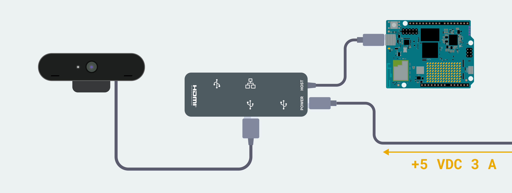
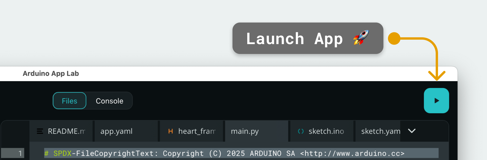
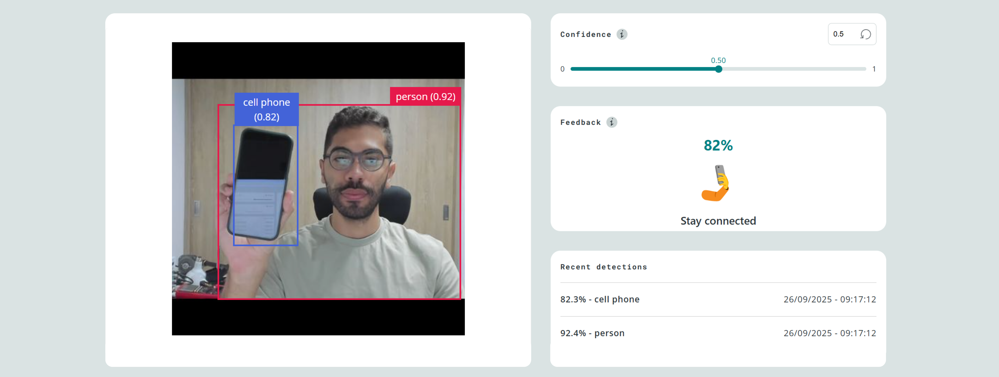

# Detect Objects on Camera

The **Detect Objects on Camera** example lets you detect objects on a live feed from a USB camera and visualize bounding boxes around the detections in real-time.

**Note:** This example must be run in **Network Mode** in the Arduino App Lab, since it requires a USB-C hub and a USB camera.


This example uses a pre-trained model to detect objects on a live video feed from a camera. The workflow involves continuously getting the frames from a USB camera, processing it through an AI model using the `video_objectdetection` Brick, and displaying the bounding boxes around detections. The App is managed from an interactive web interface.

## Brick Used

The example uses the following Bricks:

- `web_ui`: Brick to create a web interface to display the classification results and model controls.
- `video_objectdetection`: Brick to classify objects within a live video feed from a camera.
  
## Hardware and Software Requirements

### Hardware

- [Arduino® UNO Q](https://store.arduino.cc/products/uno-q)
- USB camera (x1)
- USB-C® hub adapter with external power (x1)
- A power supply (5 V, 3 A) for the USB hub (e.g. a phone charger)
- Personal computer with internet access

### Software

- Arduino App Lab

## How to Use the Example

1. Connect the USB-C hub to the UNO Q and the USB camera.
  
2. Attach the external power supply to the USB-C hub to power everything.
3. Run the App.
   
4. The App should open automatically in the web browser. You can open it manually via `<board-name>.local:7000`.
5. Position any object in front of the camera and watch as the App detects and recognizes them.

Try with one of the following objects for a special reaction:

- Cat
- Cell phone
- Clock
- Cup
- Dog
- Potted plant



## How it Works

This example hosts a Web UI where we can see the video input from the camera connected via USB. The video stream is then processed using the `video_objectdetection` Brick. When an object is detected, it is logged along with the confidence score (e.g. 95% potted plant).

Here is a brief explanation of the full-stack application:

### 🔧 Backend (main.py)

- Initializes the app Bricks:
  - **WebUI** (`ui = WebUI()`): channel to push messages to the frontend.
  - **VideoObjectDetection** (`detection_stream = VideoObjectDetection()`): runs object detection on the video stream.

- Wires detection events to actions using callbacks:
  - `on_detect_all(send_detections_to_ui)`: sends `{ content, confidence, timestamp }` via `ui.send_message("detection", ...)`

- **Controls**:
  - Listens for `override_th` → updates detection threshold

- Exposes:
  - **Realtime messaging**: publishes detection updates to the frontend via `ui.send_message("detection", message=entry)` so the UI can display live detections.

- Runs with `App.run()` which starts the internal event loop and keeps the detection stream and UI messaging alive.

---

### 💻 Frontend (index.html + app.js)

- **Video feed**
  - iframe auto-retries /embed until the camera stream is available

- **Controls**
  - Slider, numeric input, and reset button adjust threshold live
  - Updates sent to backend with: `socket.emit("override_th", value)`

- **Feedback**
  - Shows GIF + text for known objects (dog, cat, cup, cell phone, clock, potted plant)

- **Recent detections**
  - Displays the last 5 detections with percentage and timestamp

- **Connection status**
  - Shows an error message if the WebSocket connection drops

---

## Understanding the Code

Once the application is running, you can open it in your browser by navigating to `<BOARD-IP-ADDRESS>:7000`.  
At that point, the device begins performing the following:

- Serving the **object detection UI** and exposing realtime transports.

    The UI is hosted by the `WebUI` Brick and communicates with the backend via WebSocket (Socket.IO).  
    The backend pushes detection messages whenever new objects are found.

    ```python
    from arduino.app_bricks.web_ui import WebUI
    from arduino.app_bricks.video_objectdetection import VideoObjectDetection
    from datetime import datetime, UTC

    ui = WebUI()
    detection_stream = VideoObjectDetection()

    ui.on_message("override_th",
                  lambda sid, threshold: detection_stream.override_threshold(threshold))

    detection_stream.on_detect_all(send_detections_to_ui)
    ```

    - `detection` (WebSocket message): JSON entry with label, confidence, and timestamp sent to the UI.  
    - `override_th` (WebSocket → backend): adjusts the confidence threshold live.

- Processing detections and broadcasting updates.

    When the model detects objects, the backend:

    1. Iterates over all detected objects with their confidence scores.  
    2. Attaches an ISO 8601 UTC timestamp.  
    3. Publishes each detection as a JSON entry to the frontend channel `detection`.

    ```python
    def send_detections_to_ui(detections: dict):
        for key, value in detections.items():
            entry = {
                "content": key,
                "confidence": value,
                "timestamp": datetime.now(UTC).isoformat()
            }
            ui.send_message("detection", message=entry)
    ```

- Rendering and interacting on the frontend.

    The **index.html + app.js** bundle defines the interface:

    - A **video feed iframe** auto-retries `/embed` until the camera stream is live.  
    - A **confidence control** (slider + input + reset) lets the user adjust the detection threshold.  
    - A **feedback section** shows animations and messages for known classes (cat, dog, cup, clock, potted plant, etc.).  
    - A **recent detections list** displays the latest 5 detections with percentage and timestamp.  

    ```javascript
    const socket = io(`http://${window.location.host}`);

    socket.on('detection', (message) => {
        printDetection(message);   // update history
        renderDetections();        // redraw the list
        updateFeedback(message);   // update feedback panel
    });
    ```

    - `detection` (WebSocket): received whenever the backend publishes results.  
    - The slider and input dynamically update the backend threshold (`override_th`).  
    - If the connection drops, an error banner is shown (`error-container`).  

- Executing the event loop.

    Finally, the backend keeps everything alive with:

    ```python
    App.run()
    ```

    This maintains the object detection stream, callback hooks, threshold overrides, and WebSocket communication with the frontend.
